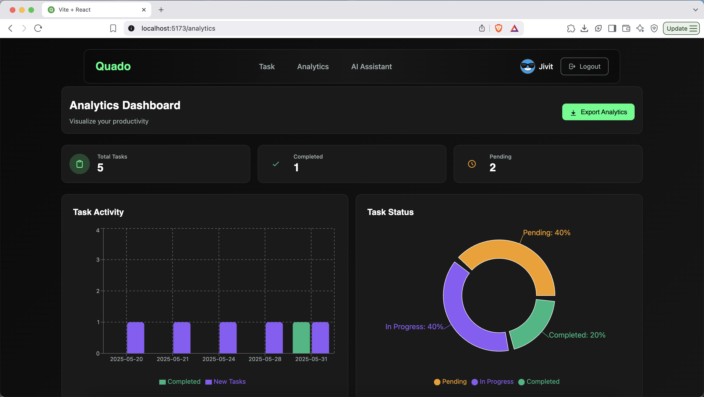

# Quado

A full-stack Task Management application built using the MERN stack (MongoDB, Express.js, React, Node.js). It offers secure authentication, smart task organization, real-time updates, and a rich analytics dashboard. Powered by Google Gemini AI for personalized productivity insights.

---

## 📸 Screenshots

<div align="center">
  
  <p><i>Main Dashboard</i></p>
</div>

<div align="center">
  
  <p><i>Analytics Dashboard</i></p>
</div>

<div align="center">
  
  <p><i>AI Assistant</i></p>
</div>

<div align="center">
  
  <p><i>Login</i></p>
</div>

<div align="center">
  
  <p><i>Mobile Responsive Design</i></p>
</div>

---

## ⚙️ Tech Stack

### Frontend
- React 19, Vite
- TailwindCSS, Framer Motion
- React Router DOM, Axios
- React Hot Toast, Recharts

### Backend
- Node.js
- Express.js
- MongoDB (Mongoose)
- JWT Authentication
- Google Gemini AI Integration


## 📁 Project Structure

```
├── frontend/               # React frontend application
│   ├── src/               # Source files
│   ├── public/            # Static files
│   └── package.json       # Frontend dependencies
│
└── backend/               # Node.js backend application
    ├── config/           # Configuration files
    ├── controllers/      # Route controllers
    ├── middleware/       # Custom middleware
    ├── models/          # Database models
    ├── routes/          # API routes
    ├── scripts/         # Utility scripts
    └── server.js        # Entry point
```

## 🛠️ Setup and Installation

### Prerequisites
- Node.js (v18 or higher)
- MongoDB
- npm or yarn

### Frontend Setup
1. Navigate to the frontend directory:
   ```bash
   cd frontend
   ```
2. Install dependencies:
   ```bash
   npm install
   ```
3. Start the development server:
   ```bash
   npm run dev
   ```

### Backend Setup
1. Navigate to the backend directory:
   ```bash
   cd backend
   ```
2. Install dependencies:
   ```bash
   npm install
   ```
3. Create a `.env` file in the backend directory with the following variables:
   ```
   PORT=5000
   MONGODB_URI=your_mongodb_uri
   JWT_SECRET=your_jwt_secret
   GEMINI_API_KEY=your_gemini_api_key
   ```
4. Start the server:
   ```bash
   npm start
   ```

## Features

- **Modern UI & UX**
  - TailwindCSS design
  - Responsive layout & dark mode
  - Toasts, loaders, error handling

- **Authentication & Security**
  - JWT auth
  - Protected routes
  - Secure APIs

- **Task Management**
  - Create, edit, delete tasks
  - Categories, priorities, statuses
  - Filters, sorting, due dates

- **Analytics Dashboard**
  - Completion stats, overdue & due-today
  - Category breakdown
  - 30-day history & performance insights

- **AI Integration (Gemini)**
  - Daily planner & smart priority
  - Task insights, quotes, focus tips

## License
This project is licensed under the ISC License.

## Authors
- Jivit Rana

## Acknowledgments
- Thanks to all the open-source libraries and tools used in this project 
